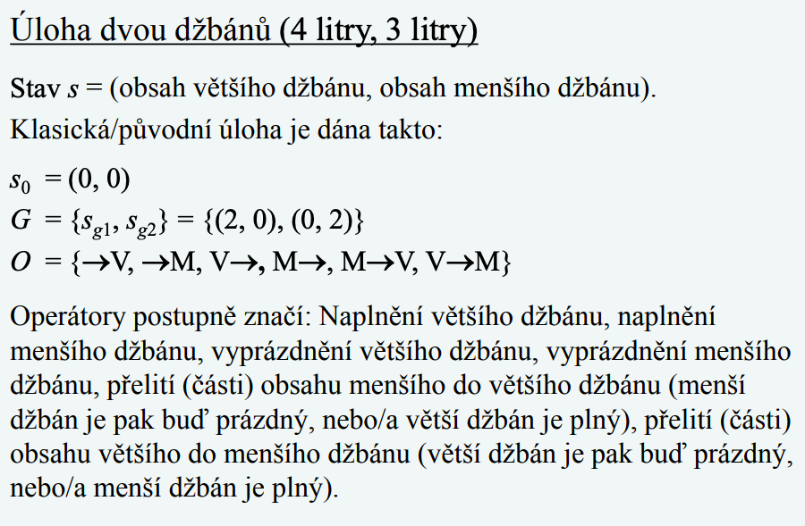
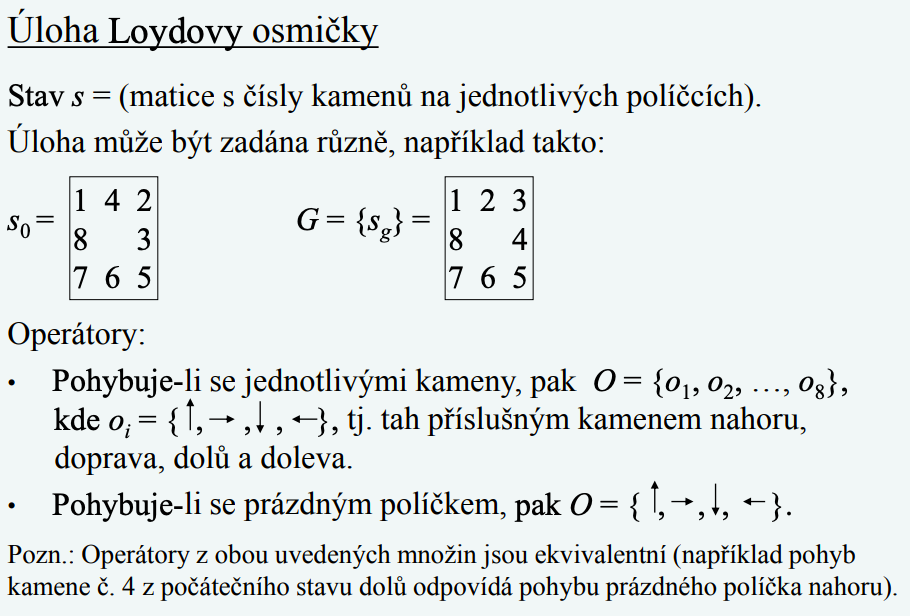

# IZU Přednáška 1
## Úvod - Definice
Inteligence byla dlouhou dobu přisuzovaná pouze lidem, ale v poslední době se zjišťuje i u zvířat a dokonce i u některých rostlin.
Definovat inteligenci je poněkud složité, protože doteď nebyl definovaný pojem “inteligence”.
My si ji budeme definovat takto: 
- **Inteligence** - slovo odvozené z latinského intelligentia, které zmanená schopnost rozlišovat, racionálně poznávat a chápat
- **Umělá inteligence (AI)** - Je označována inteligence neživých subjektů (implementace ve formě programů apod..)

## Klasická umělá inteligence
Všechny úlohy jsou založeny na pojmech
- Stavový prostor (S,O)
- Množina stavů úlohy S = {si}, i = 1, 2,...
- Množina operátorů O = {oj}, j = 1, 2, ...

Aplikace operátorů a jednotliveé stavy jsou prakticky vždy omezené nějakými podmínkami, které jsou závislé na konkrétní úloze. Existují úlohy, které se nazývají CSPs (Constraint Satisfaction Problems), kde nás zajímá pouze cíl.

### Typy UI úloh
- Umělé úlohy (hříčky)
	- Úloha dvou džánů
	- Úloha Loydovy osmičky
	- úloha osmi dam (CSP)
	- úloha hanojských věží
	- úloha balančních vah
- Reálné úlohy
	- Problém nalezení optimání cesty
	- Problém obchodního cestujícího
	- Problém barvení map

