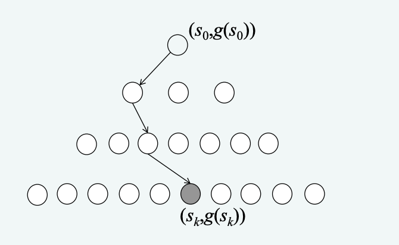

# IZU Přednáška 2
Všechny metody přehledně i s obrázky v prezentaci (akorát bych tu opisoval pyčoviny)
https://www.fit.vutbr.cz/study/courses/IZU/private/1819izu_2.pdf
## UCS - Uniform Cost Search (slepé prohledávání do šířky s respektováním cen přechodů)

1. Sestrojíme seznam OPEN a umístíme do něj počáteční uzel včetně jeho nulového ohodnocení
2. Je-li seznam OPEN prázdný, pak úloha nemá řešení a ukončí se proto prohledávání jako neúspěšné. Jinak pokračujeme.
3. Vybereme z OPEN uzel s nejnižším ohodnocením.
4. Je-li ten stav s nejnižším ohodnocením cílovým, tak je metoda úspěšná
5. Pokud metoda úspěšná není, expandujeme do OPEN včetně ohodnocení (získáme všechny bezprostřední následnovníhy daného uzlu) a vrátíme se na bod 2. Pokud se nějaký uzel vyskytuje vícekrát, vybereme ten s nejmenším ohodnocením a ostatní vymažeme.

_Spousta studentů dělá tu chybu, že v momentě, kdy se v OPEN objeví jejich cílový stav, tak přestanou expandovat a prohlásí to za řešení. - Naleznou řešení, ale nikoliv optimální._

## Backtracking (slepé prohledávání se zpětným navrácením)
1. Sestrojíme zásobník OPEN (bude obsahovat uzly určené k expanzi) a umístíme do něj počáteční uzel
2. Je-li OPEN prázdný, pak úloha nemá řešení
3. Pokud lze na uzel na vršku zásobníku aplikovat operátor, tak tento operátor aplikujeme a pokračujeme dále, jinak odstraníme uzel ze zásobníku a vrátíme se na 2.
4. Pokud je vygenerovaný uzel cílovým, je to úspěšné. Pokud ne, tak ho vložíme na vršek zásobníku a vrátíme se na 2. 

## Forward checking
